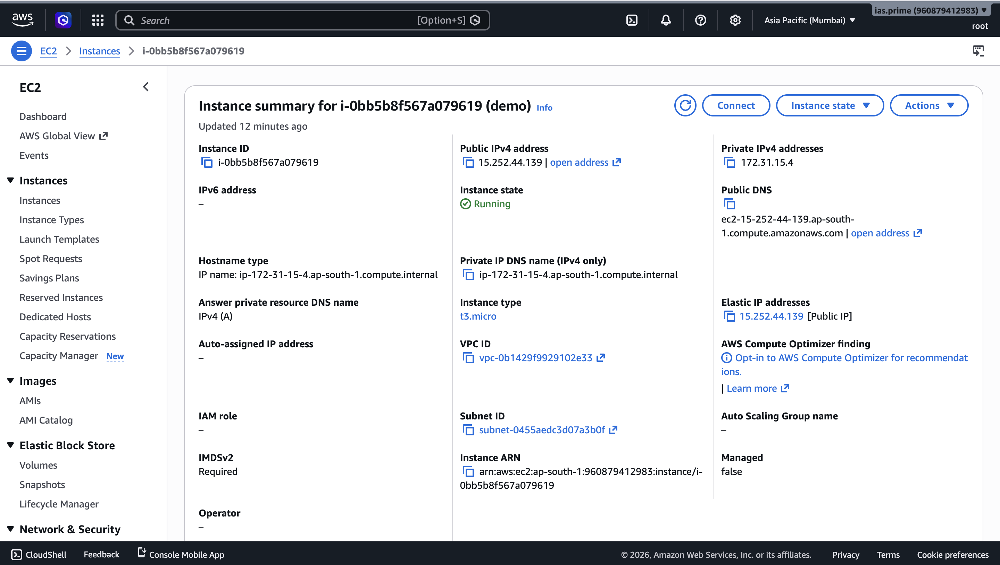
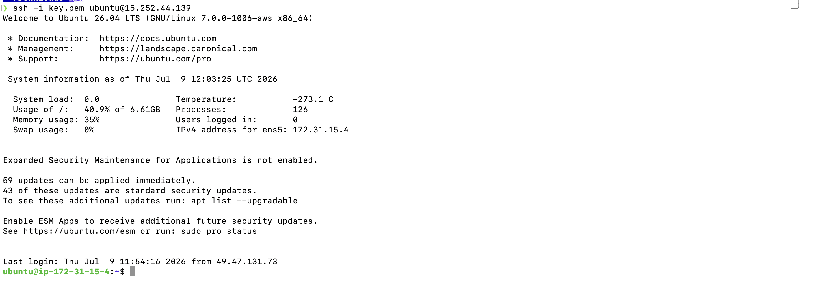
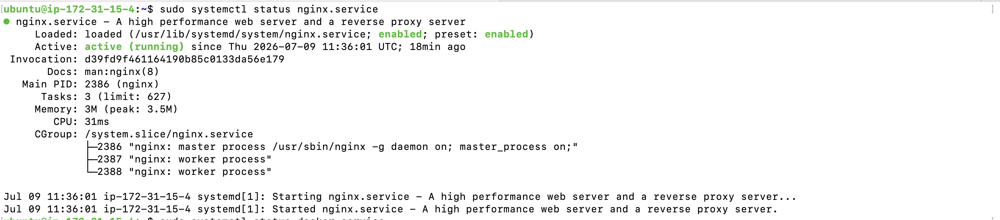
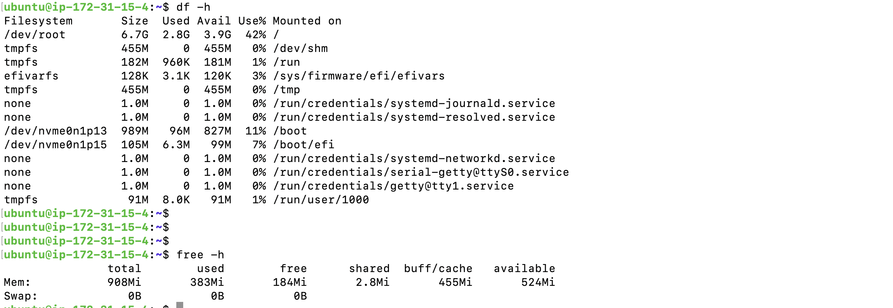
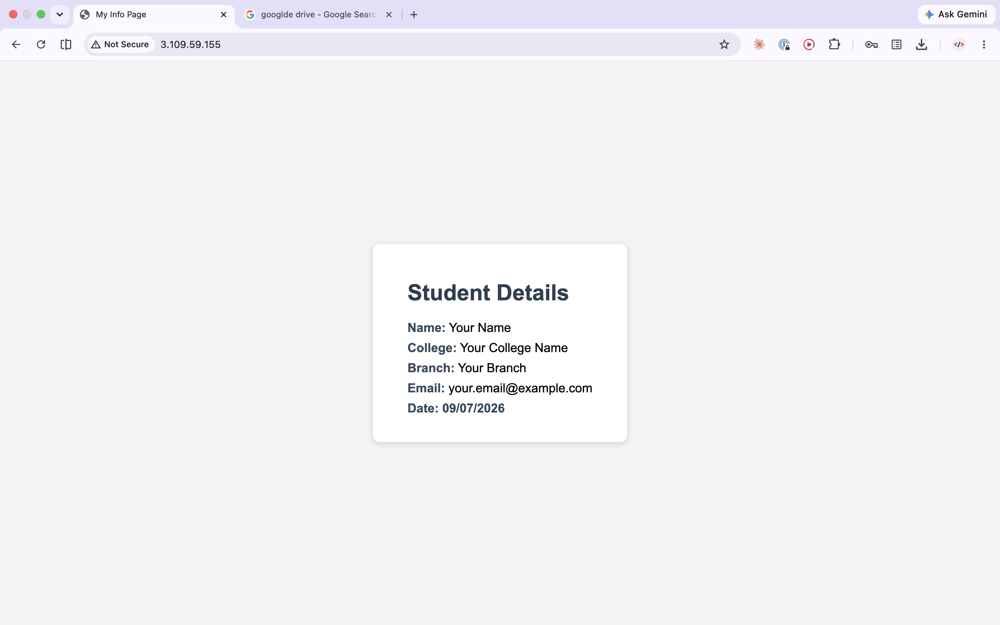
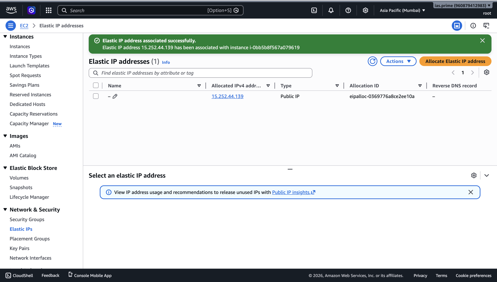
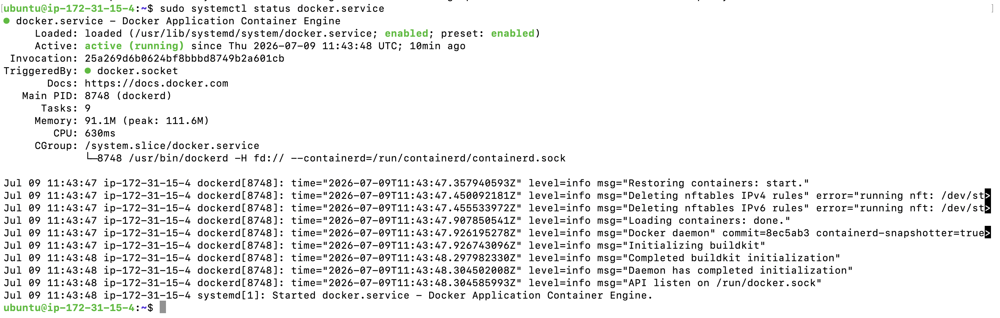
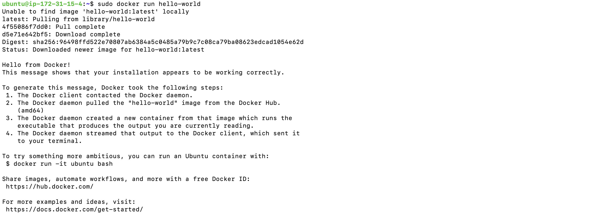

### AWS DevOps Intern Assignment — EC2 + Nginx Website Deployment

Deploys a static HTML page on an Ubuntu EC2 instance behind Nginx. Bonus tasks completed: Elastic IP attached and Docker installed and verified.

#### Task 1: EC2 Instance Setup

Instance details:
```
Instance ID     : i-0bb5b8f567a079619
Name             : demo
AMI              : Ubuntu
Instance type    : t3.micro
Region           : ap-south-1 (Asia Pacific - Mumbai)
VPC              : vpc-0b1429f9929102e33
Subnet           : subnet-0455aedc3d07a3b0f
Private IPv4     : 172.31.15.4
Public IPv4      : 15.252.44.139 (Elastic IP)
Public DNS       : ec2-15-252-44-139.ap-south-1.compute.amazonaws.com
```

Security Group inbound rules: TCP 22 (SSH) and TCP 80 (HTTP) open from `0.0.0.0/0`.

Restrict the key file permissions so SSH accepts it (required, otherwise SSH refuses the key with an UNPROTECTED PRIVATE KEY FILE error).
```
chmod 400 key.pem
```

Connect to the instance over SSH.
```
ssh -i key.pem ubuntu@15.252.44.139
```

EC2 instance dashboard:



SSH login:



#### Task 2: Linux Basics and Nginx Installation

Update the package index and install Nginx.
```
sudo apt update
sudo apt install nginx -y
```

Check whether Nginx is installed and running.
```
sudo systemctl status nginx.service
```

Restart Nginx after a config or content change.
```
sudo systemctl restart nginx.service
```

List listening TCP/UDP ports to confirm Nginx is bound to port 80.
```
ss -tulpn
```

Check the instance's public IP as seen from outside AWS.
```
curl ifconfig.me
```

Check disk usage.
```
df -h
```

Check memory and swap usage.
```
free -h
```

Nginx active and running:



Disk and memory usage:



#### Task 3: Website Deployment

Nginx's default site config (`/etc/nginx/sites-available/default`) serves from `/var/www/html` and prefers `index.html` over the stock `index.nginx-debian.html`.

Create the custom page.
```
sudo vim /var/www/html/index.html
```

Reload Nginx to serve the new page.
```
sudo systemctl restart nginx.service
```

Website preview:



#### Task 4: Git and GitHub

Repository contents:
```
index.html                 — website source, uploaded as-is from /var/www/html/index.html
README.md                  — this file
linux-basics-nginx.md      — full command reference and troubleshooting notes for Tasks 2-3
docker-installation.md     — Docker Engine apt-repository install reference
nginx-info-page.png        — Task 3 website screenshot
ec2-dashboard.png          — Task 1 evidence: EC2 instance summary
ssh-login-terminal.png     — Task 1 evidence: SSH login
nginx-status.png           — Task 2 evidence: Nginx active and running
disk-memory-usage.png      — Task 2 evidence: df -h and free -h output
elastic-ip.png             — bonus evidence: Elastic IP allocated and associated
ec2-with-elasticip.png     — bonus evidence: instance summary with Elastic IP
docker-status.png          — bonus evidence: Docker service active and running
docker-hello-world.png     — bonus evidence: docker run hello-world output
```

#### Bonus: Elastic IP (+10)

Allocated an Elastic IP and associated it with the running instance so the public IP stays fixed across stop/start cycles.
```
Elastic IP        : 15.252.44.139
Allocation ID     : eipalloc-0369776a8ce2ee10a
Associated with   : i-0bb5b8f567a079619
```




Note: the public IP changed from the original auto-assigned `3.109.59.155` to the fixed Elastic IP `15.252.44.139` after this step — any earlier screenshots or links using the old IP need updating.

#### Bonus: Docker Installed and Verified

Installed Docker Engine via the apt repository (see `docker-installation.md` for the full step-by-step) and confirmed the service is active.
```
sudo systemctl status docker.service
```



Run the hello-world test container to confirm the install.
```
sudo docker run hello-world
```



#### Further Reference

See `linux-basics-nginx.md` for the full command list with one-line explanations and a troubleshooting section (SSH drops, Security Group checks, stale page caching).
